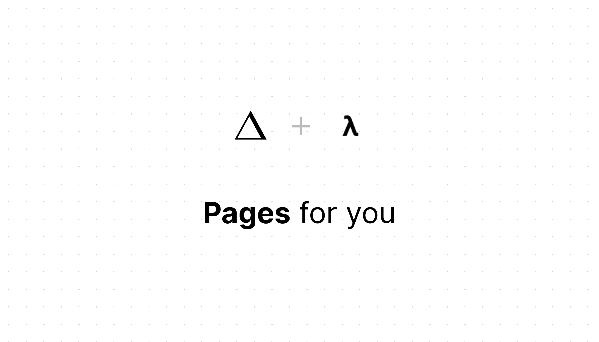

 

# show pages

Your `README.md` is home pages. try url: `https://pages.now.sh/{your_name}/{repo_name}`.

**dark mode**: append `?dark=1`.

**tect-center**: append `?center=1`

**alias**: just point your domain `cname` to link.

 

## demos
  
  - my project: https://pages.now.sh/unix/done
  - facebook react: https://pages.now.sh/facebook/react
  - dark: https://pages.now.sh/unix/koa2-typescript-guide?dark=1
  
 

## styles
ui from [zeit-style](https://github.com/zeit-ui/zeit-style), originating from [Zeit Design](https://zeit.co/design).

 

## license
[MIT](LICENSE)

